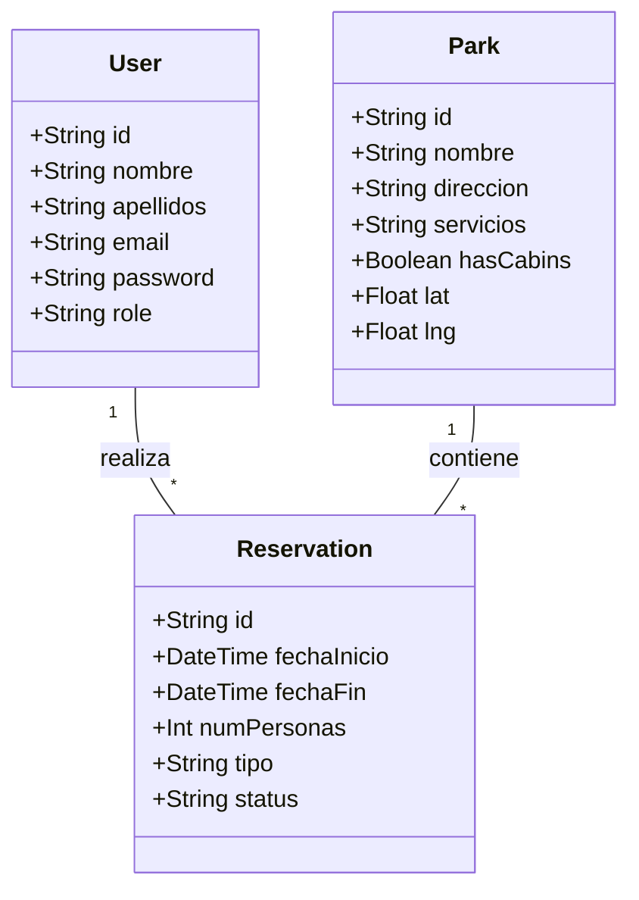

# 🌲 LuciMap - Documentación del Proyecto

## Información de Portada
- **Nombre del Proyecto:** LuciMap - Sistema de Gestión del Festival de las Luciérnagas 2026
- **Nombre de la Empresa (Equipo):** *DevLumina Solutions*
- **Integrantes:** [Nombre del Alumno / Equipo]
- **Fecha:** Junio 2026

---

## 1. Propuesta de Valor del Proyecto
**LuciMap** centraliza y moderniza la experiencia de reservación para el Festival Internacional de las Luciérnagas. Para los turistas, ofrece una plataforma interactiva, segura y visualmente inmersiva que garantiza su lugar sin riesgo de sobreventa. Para los administradores, proporciona un panel centralizado que optimiza el control de aforos, respeta los días de mantenimiento ambiental (martes) y mejora la comunicación mediante generación automática de Códigos QR y correos de confirmación.

---

## 2. Levantamiento de Requerimientos y Especificaciones
### Tipos y Fuentes de Requisitos
- **Fuentes:** Documento de lineamientos del proyecto final, restricciones operativas del parque (mantenimientos los martes), limitantes de temporada (junio - agosto).
- **Tipos de Requisitos:**
  - *Funcionales:* Autenticación JWT, creación de reservaciones, validación de fechas, envío de correo, escaneo de QR, panel CRUD de parques.
  - *No Funcionales:* Seguridad (bcrypt, Helmet/CORS), escalabilidad (arquitectura limpia), experiencia de usuario (frontend responsivo y deslumbrante).

### Historias de Usuario Principales
1. **HU-01 (Registro):** Como *Turista*, quiero registrarme con mi correo y contraseña para poder acceder al sistema de reservaciones.
2. **HU-02 (Exploración):** Como *Turista*, quiero ver un mapa interactivo y una galería de los parques para elegir mi experiencia ideal (Cabaña o Camping).
3. **HU-03 (Reserva):** Como *Turista*, quiero reservar fechas específicas dentro de la temporada oficial para garantizar mi lugar.
4. **HU-04 (Administración):** Como *Admin*, quiero ver un listado de todas las reservaciones globales para tener control del flujo de visitantes.

---

## 3. Diagramas de Arquitectura y UML

### Diagrama de Clases (Modelos Base de Datos)


### Diagramas de Casos de Uso y Actores
```mermaid
usecaseDiagram
    actor Cliente
    actor Administrador

    Cliente --> (Registrarse / Iniciar Sesión)
    Cliente --> (Explorar Parques en Mapa)
    Cliente --> (Crear Reservación)
    Cliente --> (Cancelar Reservación)

    Administrador --> (Iniciar Sesión)
    Administrador --> (Crear / Editar Parques)
    Administrador --> (Ver Todas las Reservaciones)
    Administrador --> (Ver Gestión de Usuarios)
```

---

## 4. Diseño y Metodología de Software

### Patrones Arquitectónicos y de Diseño
- **Clean Architecture (MVC + Repositorio):** Se separó la lógica en capas estrictas:
  - *Rutas (Router):* Solo reciben la petición de red.
  - *Controlador:* Orquesta los datos.
  - *Servicio:* Lógica de negocio pura (ej. `AvailabilityService`).
  - *Repositorio:* Única capa que interactúa directamente con Prisma ORM.
- **Patrón Singleton:** Utilizado para la instancia de `PrismaClient` evitando múltiples conexiones a la base de datos.

### Ciclo de Vida del Software (Mezclado con SCRUM)
Se utilizó un enfoque **Ágil (SCRUM)** montado sobre un ciclo de vida **Iterativo e Incremental**:
1. *Iteración 1:* Scaffold y Modelado de Base de datos.
2. *Iteración 2:* Backend Core (Auth, Middlewares, APIs).
3. *Iteración 3:* Frontend y UX (Integración del Mapa, consumo de API, Diseño Visual).
4. *Iteración 4:* Refinamiento y Pruebas (Unitarias y de Integración).

### Asignación de Roles (SCRUM)
- **Product Owner:** Define los requerimientos del festival y las reglas de negocio (ej. no martes).
- **Scrum Master:** Responsable de mantener el tablero Trello actualizado, remover bloqueos técnicos y asegurar la limpieza del código.
- **Development Team:** Implementa las Historias de Usuario en el stack React + Express.
*(Nota: Al ser un proyecto "Solo Developer", los sombreros cambian según la fase de la iteración).*

---

## 5. Casos de Uso: Precondiciones y Postcondiciones
**Caso de Uso: Crear Reservación (Camino Feliz)**
- **Precondiciones:** El usuario está logueado (`role: CLIENT`), las fechas caen entre junio y agosto, y no incluyen martes.
- **Flujo:** El usuario selecciona el parque, elige fechas, número de personas, y da clic en reservar. El sistema valida disponibilidad.
- **Postcondiciones:** Se crea el registro en BD, se genera el QR, el usuario recibe un correo electrónico de confirmación, y su vista se actualiza.

---

## 6. Refactorizaciones Justificadas (Clean Code)

**Refactorización 1: Extracción del `AvailabilityService`**
- *Antes:* Toda la validación de fechas (checar si era junio/agosto, checar si incluía martes, checar overlaps) estaba anidada en un bloque gigante de 50 líneas dentro del `reservations.controller.ts`.
- *Después:* Se crearon funciones puras (`isWithinFestivalPeriod`, `containsMaintenanceDay`) en un archivo de servicio independiente.
- *Justificación:* Permite probar la lógica de fechas utilizando pruebas unitarias en `Vitest` sin necesidad de levantar una base de datos o simular peticiones HTTP (Separation of Concerns).

**Refactorización 2: Composición de Middlewares de Seguridad**
- *Antes:* Cada endpoint privado extraía el token del header, lo verificaba con `jwt.verify` e instanciaba el error manualmente (código duplicado).
- *Después:* Se crearon los middlewares encadenables `authGuard` y `roleGuard`.
- *Justificación:* El controlador ahora es limpio y delegamos la responsabilidad a Express, garantizando que ninguna ruta quede desprotegida accidentalmente (`router.post('/', authGuard, roleGuard('ADMIN'), ...)`).

---

## 7. Pruebas y Seguridad
- **Unit Testing:** Implementadas con *Vitest* para la lógica pura de negocio.
- **Integration Testing:** Implementadas con *Supertest* atacando directamente la API y la base de datos de pruebas (Validando códigos 201, 400, 401 y 403).
- **Seguridad y Ética:** 
  - Encriptación estricta de contraseñas (`bcrypt` cost 12).
  - Protección contra Inyecciones SQL vía ORM.
  - Protección de acceso mediante *Role-Based Access Control (RBAC)* asegurando la confidencialidad de la información de otros clientes.
